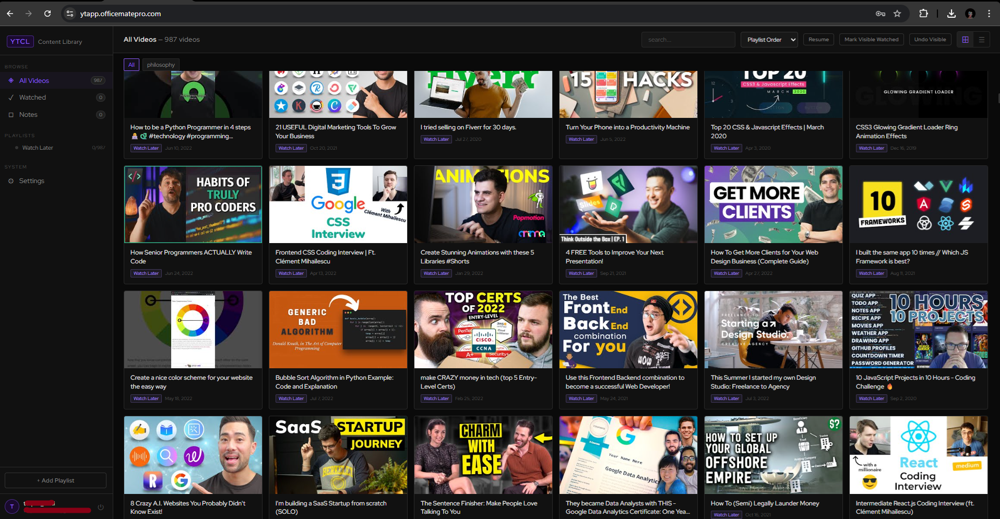

# YT Content Library

A self-hosted web app for saving, browsing, and tracking YouTube playlists. Import any public playlist, mark videos as watched, attach personal notes and custom tags — all stored in your own database.



---

## Features

- **Playlist import** — paste any public YouTube playlist URL to fetch all videos via the YouTube Data API
- **Watch tracking** — mark videos watched/unwatched per user
- **Notes & custom tags** — attach personal notes and tags to any video
- **Email auth** — register/login with email verification via Brevo SMTP
- **Password reset** — secure token-based reset flow with 1-hour expiry
- **Rate limiting** — configurable daily playlist fetch limit per user
- **Server-side API proxy** — YouTube API key is never exposed to the browser
- **Zero dependencies** — plain PHP + MySQL, no Composer, no npm

---

## Stack

| Layer    | Tech                              |
|----------|-----------------------------------|
| Frontend | Vanilla HTML/CSS/JS (single file) |
| Backend  | PHP 8.1+ (single file)            |
| Database | MySQL 5.7+ / MariaDB 10.4+        |
| Email    | Brevo (formerly Sendinblue) SMTP  |
| Video    | YouTube Data API v3               |

---

## Requirements

- PHP **8.1 or higher** (uses `never` return type, named arguments)
- MySQL **5.7+** or MariaDB **10.4+**
- PHP extensions: `pdo_mysql`, `openssl` (for SMTP SSL socket)
- A **Brevo** account (free tier: 300 emails/day)
- A **Google Cloud** project with YouTube Data API v3 enabled

---

## Setup

### 1. Clone the repo

```bash
git clone https://github.com/your-username/yt-content-library.git
cd yt-content-library
```

### 2. Create the config file

Copy the example config and fill in your credentials:

```bash
cp db_config_x7k.example.php db_config_x7k.php
```

Then open `db_config_x7k.php` and fill in all values (see [Configuration](#configuration) below).

> ⚠️ `db_config_x7k.php` is gitignored. **Never commit it.**

### 3. Create the database

Create a MySQL database and user:

```sql
CREATE DATABASE yt_content_library CHARACTER SET utf8mb4 COLLATE utf8mb4_unicode_ci;
CREATE USER 'yt_user'@'localhost' IDENTIFIED BY 'strong_password_here';
GRANT ALL PRIVILEGES ON yt_content_library.* TO 'yt_user'@'localhost';
FLUSH PRIVILEGES;
```

Update `DB_NAME`, `DB_USER`, and `DB_PASS` in your config file.

### 4. Run the table setup

Upload all files to your server, then visit:

```
https://yourdomain.com/db_config_x7k.php?setup=1
```

You should see a success message listing all created tables.

> ⚠️ **Delete or block `db_config_x7k.php` immediately after setup.** See [Securing the Config File](#securing-the-config-file).

### 5. You're live

Visit `https://yourdomain.com` — register an account, verify your email, and start importing playlists.

---

## Configuration

All configuration lives in `db_config_x7k.php`. Here's what each constant does:

### Database

| Constant     | Description                        |
|--------------|------------------------------------|
| `DB_HOST`    | MySQL host, usually `localhost`     |
| `DB_NAME`    | Database name                      |
| `DB_USER`    | Database username                  |
| `DB_PASS`    | Database password                  |
| `DB_CHARSET` | Leave as `utf8mb4`                 |

### SMTP (Brevo)

| Constant         | Description                                              |
|------------------|----------------------------------------------------------|
| `SMTP_HOST`      | `smtp-relay.brevo.com` (don't change)                   |
| `SMTP_PORT`      | `465` (SSL — don't change)                              |
| `SMTP_USER`      | Your Brevo SMTP login (looks like `abc@smtp-brevo.com`) |
| `SMTP_PASS`      | Your Brevo SMTP password/key                            |
| `SMTP_FROM`      | Sender address — must be a verified sender in Brevo     |
| `SMTP_FROM_NAME` | Display name shown in emails                            |

### App

| Constant    | Description                                   |
|-------------|-----------------------------------------------|
| `APP_URL`   | Your full domain, no trailing slash            |
| `APP_NAME`  | Display name used in emails and the UI         |

### YouTube

| Constant                     | Description                                              |
|------------------------------|----------------------------------------------------------|
| `YT_API_KEY`                 | Your Google YouTube Data API v3 key                     |
| `MAX_PLAYLIST_FETCHES_PER_DAY` | Rate limit: playlist imports per user per day (default 20) |

---

## Getting Your API Keys

### Brevo SMTP credentials

1. Sign up at [app.brevo.com](https://app.brevo.com) (free)
2. Go to **SMTP & API** → **SMTP** tab
3. Copy your **Login** → paste as `SMTP_USER`
4. Generate a new **SMTP key** → paste as `SMTP_PASS`
5. Go to **Senders & IP** → **Senders** → add and verify your sending domain/email
6. Use that verified email as `SMTP_FROM`

> Free Brevo tier: 300 emails/day, no credit card required.

### YouTube Data API v3

1. Go to [Google Cloud Console](https://console.cloud.google.com)
2. Create a new project (or select an existing one)
3. Go to **APIs & Services** → **Library**
4. Search for **YouTube Data API v3** → click **Enable**
5. Go to **APIs & Services** → **Credentials** → **Create Credentials** → **API key**
6. Copy the key → paste as `YT_API_KEY`
7. (Recommended) Click **Restrict key** → restrict to **YouTube Data API v3** only

> Free quota: 10,000 units/day. Fetching a 200-video playlist costs ~2–4 units.

---

## Securing the Config File

After running `?setup=1`, protect `db_config_x7k.php` using one of these methods:

**Option A — Delete it** (recommended for production):
```bash
rm db_config_x7k.php
```
The `getDB()` function will still be loaded by `api.php` via `require_once` since constants are already defined.

Wait — you do need the file at runtime. Use Option B instead.

**Option B — Block web access via `.htaccess`** (Apache):
```apache
<Files "db_config_x7k.php">
    Require all denied
</Files>
```

**Option C — Block via nginx**:
```nginx
location = /db_config_x7k.php {
    deny all;
    return 403;
}
```

These rules block the `?setup=1` endpoint while still letting `api.php` include the file server-side.

---

## File Structure

```
yt-content-library/
├── index.html                 # Frontend (single file — HTML + CSS + JS)
├── api.php                    # Backend API (single file — all endpoints)
├── db_config_x7k.php          # ⚠️  Your config — gitignored, never commit
├── db_config_x7k.example.php  # Config template — safe to commit
├── .gitignore
├── README.md
└── assets/
    └── favicon.ico
```

---

## API Endpoints

All endpoints are on `api.php?action=<action>`. Auth uses `X-Auth-Token` header.

| Method | Action              | Auth | Description                          |
|--------|---------------------|------|--------------------------------------|
| POST   | `register`          | —    | Create account (sends verify email)  |
| GET    | `verify_email`      | —    | Verify email via token link          |
| POST   | `login`             | —    | Login → returns session token        |
| POST   | `logout`            | ✓    | Invalidate session                   |
| GET    | `me`                | ✓    | Get current user info                |
| POST   | `change_password`   | ✓    | Change password (requires current)   |
| POST   | `forgot_password`   | —    | Send password reset email            |
| POST   | `reset_password`    | —    | Reset password via token             |
| GET    | `playlists`         | ✓    | List user's playlists                |
| POST   | `playlists`         | ✓    | Add playlist + videos                |
| DELETE | `playlists?id=N`    | ✓    | Remove playlist                      |
| GET    | `videos`            | ✓    | List videos (optional `?playlist_id`)|
| POST   | `video_state`       | ✓    | Update watched / notes / custom_tags |
| GET    | `yt?endpoint=...`   | ✓    | Proxied YouTube Data API call        |

---

## Database Schema

```
users          — accounts (id, username, email, password_hash, verified, tokens)
sessions       — auth tokens (30-day rolling expiry)
playlists      — imported playlists per user
videos         — video metadata per playlist
user_videos    — per-user watch state, notes, custom_tags
fetch_log      — tracks daily playlist fetch count for rate limiting
```

---

## Changelog

### v2.0
- Added custom tags per video (`custom_tags` column in `user_videos`)
- Dynamic EHLO hostname derived from `APP_URL` (removes hardcoded domain)
- Standardised config template (`db_config_x7k.example.php`)
- Security: config file excluded from git via `.gitignore`

### v1.0
- Initial release

---

## License

MIT — do whatever you want, just don't blame me if something breaks.
